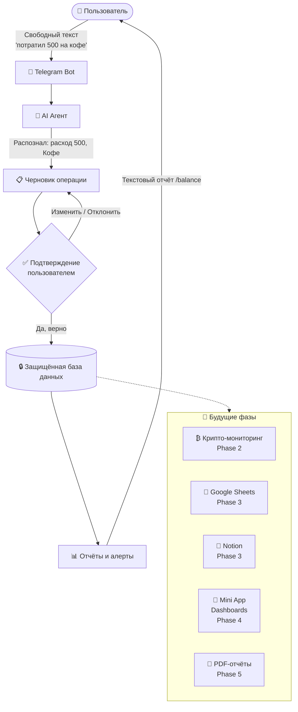
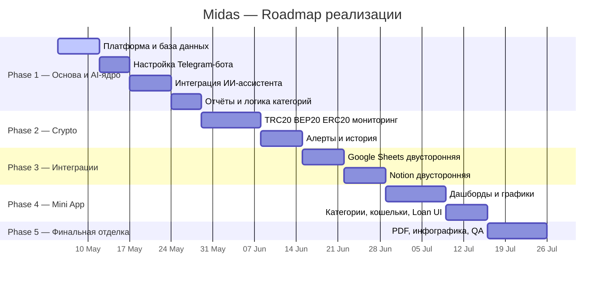

# Project Midas: Roadmap & Architecture Overview

**Версия документа:** 1.0  
**Дата:** 2026-05-04  
**Статус:** Архитектура утверждена. Phase 1 готова к старту.

---

## 1. Краткий обзор (Executive Summary)

Midas — это персональная финансовая операционная система, которая живёт прямо в Telegram. Не отдельное приложение, которое нужно скачивать и настраивать — пользователь просто открывает бот, пишет свои финансы обычным текстом, и система всё понимает.

Midas работает как ваш личный **умный ассистент-бухгалтер**. Вы не подстраиваетесь под сложный интерфейс программы — программа подстраивается под то, как вы привыкли общаться.

Ключевая идея: **AI помогает, но не решает за вас**. Система на основе искусственного интеллекта распознаёт смысл сообщения, формирует черновик операции и предлагает пользователю подтвердить. Финансовые данные записываются только после явного согласия человека. Это принципиально — никаких "умных" действий без контроля владельца.

На старте Midas — это быстрый, надёжный инструмент для фиксации расходов и доходов в Telegram с текстовыми отчётами. Фундамент системы спроектирован с прицелом на будущее: мониторинг крипто-кошельков, синхронизация с Google Sheets и Notion, визуальные дашборды в Telegram Mini App, PDF-отчёты. Эти модули добавляются поэтапно — без переписывания того, что уже работает.

---

## 2. Что делает Midas

Пользователь работает с системой так, как привык разговаривать. Никаких сложных форм, никакой ручной классификации, никакой отдельной регистрации.

❌ **Как это работает обычно:** Вы скачиваете приложение, разбираетесь в интерфейсе, вручную вводите цифры и выбираете счета из выпадающих списков.
✅ **Как это работает в Midas:** Вы просто пишете в чат обычным текстом, а всю рутину берёт на себя искусственный интеллект.

**Сегодня (Phase 1 MVP):**
- Пишешь в Telegram: *"Потратил 3200 на аренду офиса"* — бот понимает, уточняет категорию, записывает.
- Спрашиваешь `/balance` — получаешь актуальную сводку по счетам.
- Спрашиваешь `/report` — получаешь разбивку доходов и расходов за месяц по категориям.
- Создаёшь собственные категории под свой бизнес и жизнь.

**В следующих фазах:**
- Подключаешь крипто-кошельки (TRC20, BEP20, ERC20) — и видишь все входящие транзакции в одном месте.
- Синхронизируешь Google Sheets и Notion — данные текут в обе стороны автоматически.
- Открываешь Telegram Mini App — красивые дашборды, графики, фильтры по периодам и категориям.
- Скачиваешь полный PDF-отчёт за любой период по запросу.

---

## 3. Как работает система

**Как это работает на практике:**

Пользователь пишет обычное сообщение в Telegram. AI анализирует текст и формирует черновик финансовой операции — с суммой, валютой и категорией. Пользователь видит это как короткую карточку с кнопками «Верно» и «Изменить». 

> **👤 Пользователь:**
> Потратил 250 USDT на оплату сервера
> 
> **🤖 Midas Bot:**
> 📋 **Расход:** 250 USDT
> 📁 **Категория:** Техническое обслуживание
> 
> `[ ✅ Верно ]` `[ ✏️ Изменить ]`

Только после подтверждения данные сохраняются в защищённой базе. Все отчёты строятся исключительно на проверенных данных — ничего не попадает в историю без ведома пользователя.

> **🤖 Midas Bot:**
> 📊 **Отчёт за неделю**
> 
> 🟢 **Доходы:** + 1,200 USDT
> 🔴 **Расходы:** - 350 USDT
> 
> 💳 **Балансы:**
> Binance TRC20: 4,500 USDT
> TrustWallet: 0.15 ETH

Будущие модули — крипто, интеграции, Mini App — подключаются как отдельные слои поверх рабочего MVP-ядра. Это означает, что расширение продукта не затрагивает то, что уже работает стабильно.

---

## 4. Основные бизнес-гарантии

### 4.1 AI помогает, но не решает

Midas работает как внимательный личный секретарь: вы говорите обычным языком, а система сама определяет тип операции, сумму, валюту и категорию. Но AI **не сохраняет данные самостоятельно**. Каждая операция проходит через этап подтверждения пользователем — это полностью исключает риск ошибок, галлюцинаций AI и случайных записей.

### 4.2 Финансовая точность

Система спроектирована так, чтобы хранить исходную сумму, валюту и курс обмена в момент операции без потерь и округлений. Исторические данные не пересчитываются при изменении курсов. Каждый отчёт за прошлый период отражает ровно то, что было зафиксировано в тот момент — не приблизительно, а точно.

### 4.3 Изоляция рабочих пространств

Данные каждого пользователя защищены на уровне правил доступа к базе данных. Даже при нескольких пользователях на одной инфраструктуре — данные одного рабочего пространства надёжно изолированы от другого. Это не настройка в коде, это ограничение на уровне самой базы данных.

### 4.4 Контролируемый вывод AI

AI не может управлять системными данными: правами доступа, идентификаторами пользователей, статусами операций, принадлежностью к рабочему пространству. Все эти поля формируются исключительно серверной частью системы. Это исключает ситуацию, когда пользователь мог бы случайно или намеренно повлиять на внутренние данные системы через AI.

### 4.5 Надёжность под нагрузкой

Обработка сообщений происходит через управляемые очереди задач. Это означает: при всплеске сообщений система не зависает и не теряет данные, а обрабатывает их в контролируемом порядке. Внешние сервисы (AI API, Telegram) защищены от перегрузок встроенными механизмами ограничения и повтора запросов.

### 4.6 Приватность по умолчанию

Архитектура предусматривает, что финансовый текст пользователя, API-ключи и чувствительные данные не попадают в технические системы мониторинга и логирования. Это не просто политика — это встроенное в архитектуру ограничение, которое действует с первого дня.

### 4.7 Готовность к масштабированию

MVP намеренно узкий: только то, что действительно нужно с первого дня. Но фундамент — база данных, очереди, структура данных — с самого начала готов к подключению крипто-мониторинга, внешних интеграций, визуального дашборда и PDF-отчётов. Расширение не потребует переписывания ядра.

---

## 5. Roadmap реализации

Дорожная карта разбита на понятные этапы, где каждая новая фаза дополняет уже стабильное ядро:

---

### Phase 1 — Основа и AI-ядро (3–4 недели)

**Статус:** Архитектура утверждена. Готов к старту.

Первая фаза — это фундамент и рабочий инструмент. Пользователь уже может пользоваться системой: фиксировать операции текстом, подтверждать их, просматривать базовые отчёты и управлять категориями. Всё работает внутри Telegram-чата.

Что входит:
- Telegram Bot с защищённым приёмом сообщений
- AI-парсинг свободного текста (Claude Haiku)
- Подтверждение каждой операции перед сохранением
- Базовые категории расходов и доходов
- Команды `/balance` и `/report`
- Изолированная база данных с правилами безопасного доступа
- Автоматическое создание рабочего пространства при первом запуске

**Что не входит в Phase 1:** крипто-мониторинг, Google Sheets, Notion, визуальные дашборды, PDF.

---

### Phase 2 — Crypto Monitoring & Alerts (2–3 недели)

Подключение крипто-кошельков по публичному адресу — без приватных ключей и seed-фраз. Мониторинг сетей TRC20, ERC20 и BEP20. Мгновенные алерты при входящих транзакциях выше заданного порога. Автоматическая подгрузка истории при добавлении нового адреса.

---

### Phase 3 — External Integrations (2–3 недели)

Двусторонняя синхронизация с Google Sheets: агент читает данные из таблиц и записывает обратно. Аналогично для Notion: чтение финансовых данных со страниц, запись отчётов по запросу. Подключение через безопасный OAuth 2.0.

---

### Phase 4 — Telegram Mini App Frontend (3–4 недели)

Визуальный интерфейс внутри Telegram: дашборды с балансами и графиками, управление категориями, просмотр кошельков, история расходов по людям, система долгов Loan, настройки уведомлений и периодичности отчётов.

---

### Phase 5 — Финальная отделка и запуск (1–2 недели)

PDF-отчёты за любой период по запросу. Инфографика в Telegram (графики картинкой). Финальное тестирование качества, настройка мониторинга, production hardening.

---

## 6. Текущий статус проекта

На сегодняшний день завершена полная архитектурная подготовка проекта:

| Этап | Статус |
|---|---|
| Анализ требований и согласование | ✅ Завершено |
| Проектирование сценариев и потоков данных | ✅ Завершено |
| Ключевые архитектурные решения | ✅ Утверждены |
| Модель базы данных | ✅ Утверждена |
| Архитектура очередей и обработки | ✅ Утверждена |
| Проверка безопасности и трассировки | ✅ Пройден (12 security правил) |
| Scope Phase 1 | ✅ Утверждён |
| Критерии приёмки Phase 1 | ✅ Зафиксированы |
| **Начало разработки Phase 1** | 🟢 **Готов к старту** |

Фундаментальная архитектура и security baseline утверждены для начала Phase 1. Проект стартует с ясными границами, зафиксированными решениями и проверенной архитектурой — не с чистого листа.

---

## 7. Следующие шаги (Phase 1)

1. Настройка проекта и рабочей среды
2. Развёртывание базы данных и инфраструктуры
3. Реализация защищённой базы данных с изоляцией рабочих пространств
4. Подключение Telegram Bot с валидацией входящих запросов
5. Реализация AI-парсинга и логики подтверждения операций
6. Базовые категории, команды `/balance` и `/report`
7. Тесты безопасности, финансовой точности и жизненного цикла операций

---

## 8. Заключение

Midas переходит от архитектурной подготовки к контролируемой реализации первого MVP. Проект стартует не с хаотичного кодинга, а с утверждённой архитектуры, ясной и проверенной архитектурной основы безопасности, строгих правил финансовой точности и понятного roadmap на все пять фаз.

Каждое решение зафиксировано и обосновано. Каждая следующая фаза строится поверх рабочего ядра — без переписывания, без сюрпризов. Это продукт, который делается правильно с первого дня.
