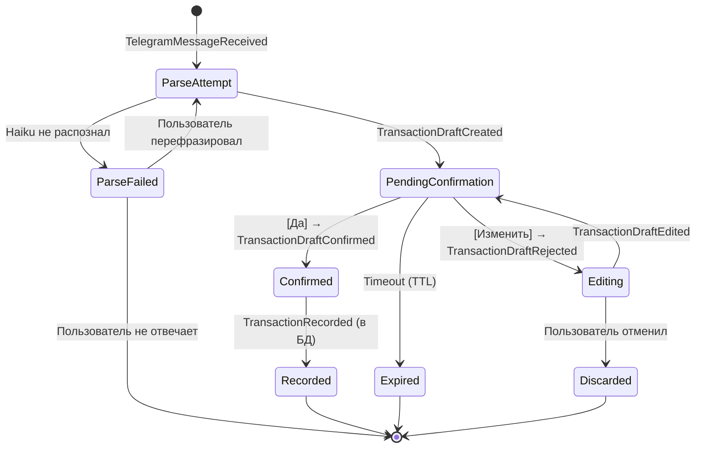
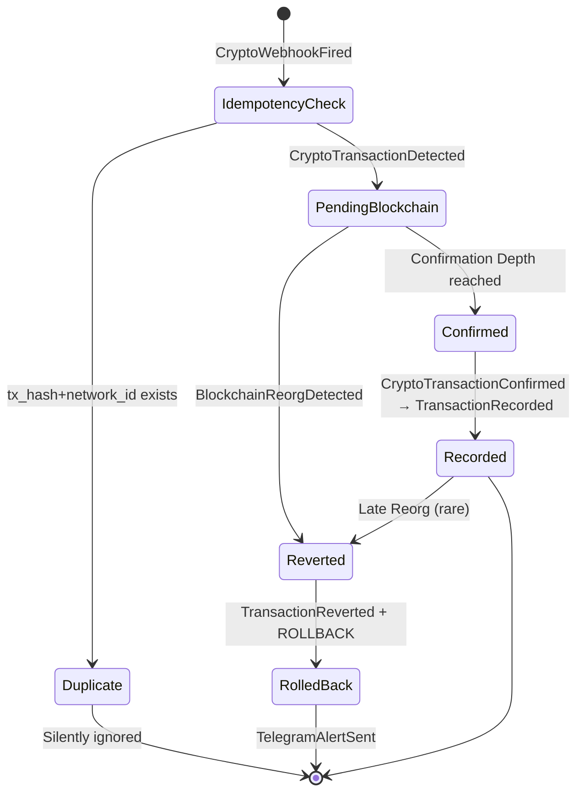
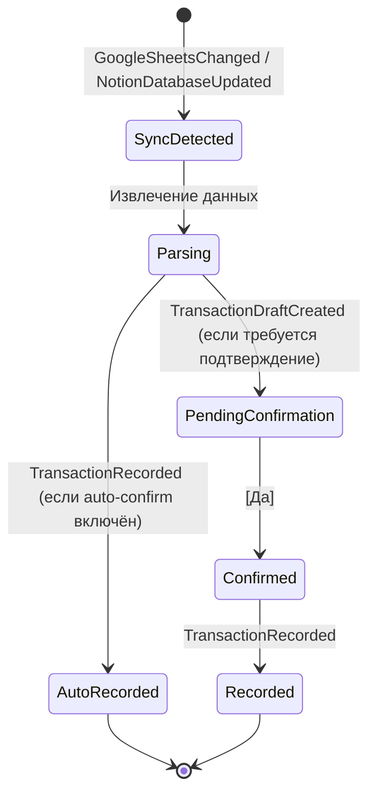
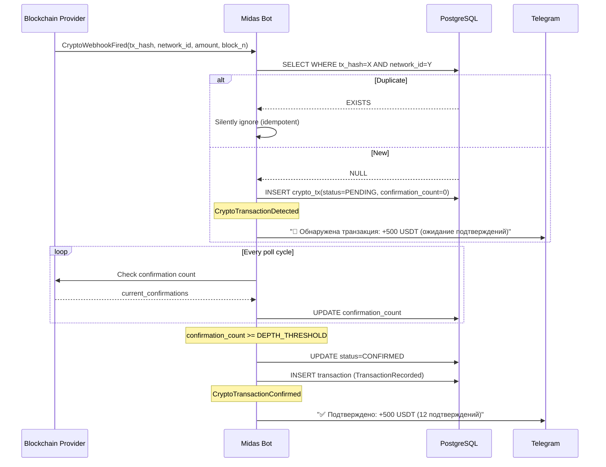
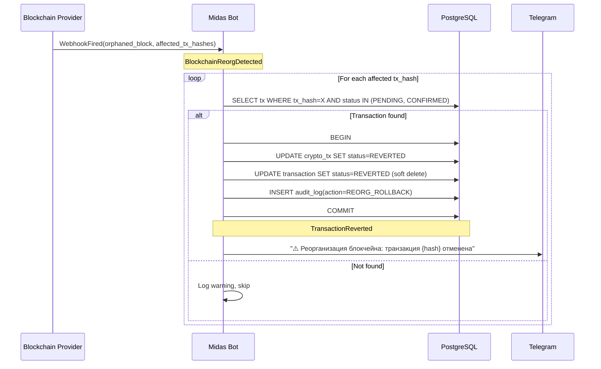
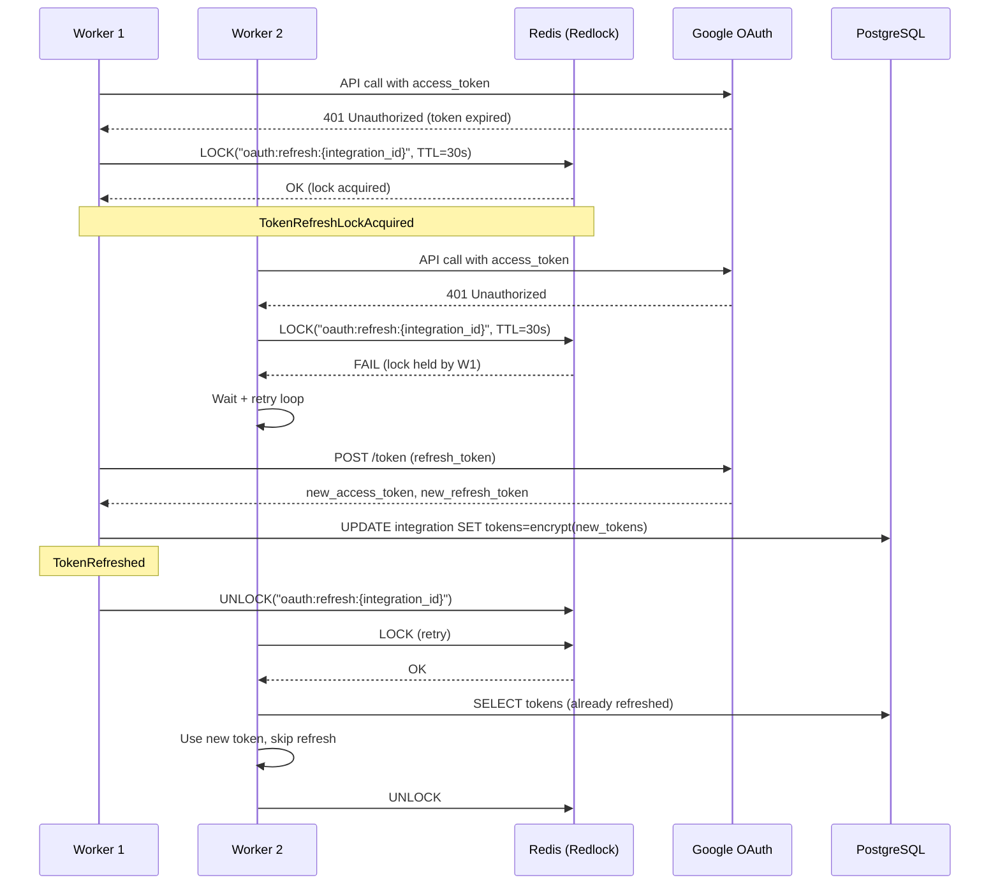
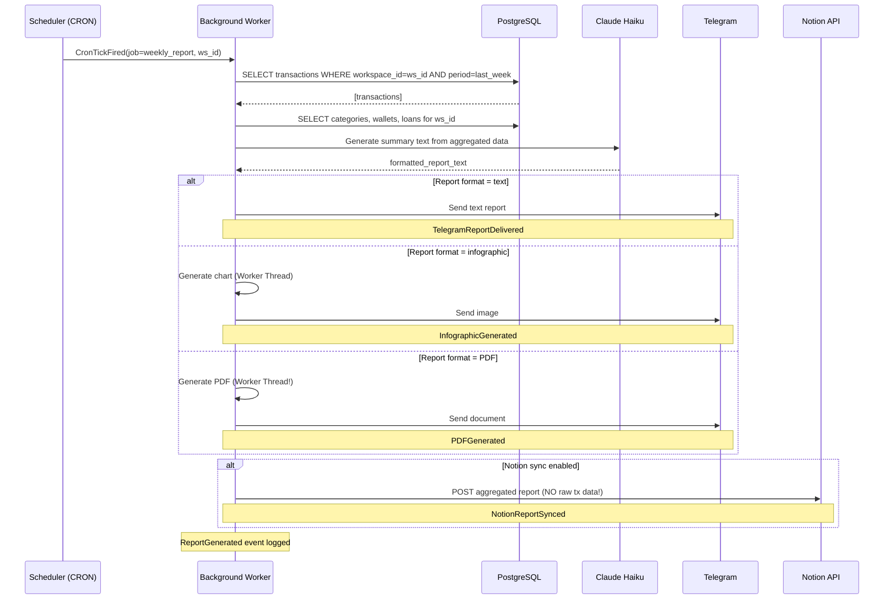

# Event Storming — Phase 0.1 (Part 2/3)
# Aggregate Map, Lifecycle, Event Flows

---

## 4. AGGREGATE MAP

### 4.1 Карта агрегатов и их границы

```
┌─────────────────────────────────────────────────────────┐
│                    WORKSPACE (Root)                      │
│                  tenant_id = ULID                        │
│                                                         │
│  ┌──────────┐  ┌─────────────┐  ┌──────────────────┐   │
│  │   User   │  │  Category   │  │   Integration    │   │
│  │          │  │ (Бизнес/    │  │ (Google/Notion)  │   │
│  │ tg_id    │  │  Жизнь)     │  │ oauth_tokens     │   │
│  └──────────┘  └─────────────┘  │ redlock_key      │   │
│                                  └──────────────────┘   │
│  ┌──────────────────────────────────────────────┐       │
│  │              Transaction                      │       │
│  │  draft_status | original_amount | currency    │       │
│  │  exchange_rate_at_timestamp | category_id     │       │
│  │  person_id | source (manual/crypto/sheets)    │       │
│  └──────────────────────────────────────────────┘       │
│                                                         │
│  ┌──────────┐  ┌──────────┐  ┌──────────┐              │
│  │  Wallet  │  │  Person  │  │   Loan   │              │
│  │ address  │  │ name     │  │ amount   │              │
│  │ network  │  │ aliases  │  │ dir(in/  │              │
│  │ readonly │  │ fuzzy_id │  │  out)    │              │
│  └──────────┘  └──────────┘  │ status   │              │
│                               │ person_id│              │
│  ┌──────────┐  ┌──────────┐  └──────────┘              │
│  │  Alert   │  │  Report  │                             │
│  │ type     │  │ type     │                             │
│  │ threshold│  │ period   │                             │
│  │ entity_id│  │ format   │                             │
│  └──────────┘  │ cron     │                             │
│                 └──────────┘                             │
└─────────────────────────────────────────────────────────┘
```

### 4.2 Связи между агрегатами

| Родитель | Дочерний | Тип связи | Кардинальность |
|---|---|---|---|
| Workspace | User | owns | 1 : N (но MVP = 1:1) |
| Workspace | Category | owns | 1 : N |
| Workspace | Transaction | owns | 1 : N |
| Workspace | Wallet | owns | 1 : N (max 5-7) |
| Workspace | Person | owns | 1 : N |
| Workspace | Loan | owns | 1 : N |
| Workspace | Integration | owns | 1 : N |
| Workspace | Alert | owns | 1 : N |
| Workspace | Report | owns | 1 : N |
| Category | Transaction | references | 1 : N |
| Person | Transaction | references | 1 : N (optional) |
| Person | Loan | references | 1 : N |
| Wallet | Transaction | references (source) | 1 : N |

---

## 5. TRANSACTION DRAFT LIFECYCLE (Конечный автомат)

### 5.1 Ручной ввод (свободный текст)



**Состояния:**
| Состояние | Описание | Переходы |
|---|---|---|
| `PARSE_ATTEMPT` | Haiku обрабатывает текст | → PENDING_CONFIRMATION / PARSE_FAILED |
| `PARSE_FAILED` | Не удалось извлечь данные | → PARSE_ATTEMPT (retry) / terminal |
| `PENDING_CONFIRMATION` | Ожидание [Да]/[Изменить] | → CONFIRMED / EDITING / EXPIRED |
| `EDITING` | Пользователь корректирует | → PENDING_CONFIRMATION / DISCARDED |
| `CONFIRMED` | Пользователь подтвердил | → RECORDED |
| `RECORDED` | Записано в БД | terminal |
| `EXPIRED` | Истёк TTL ожидания | terminal |
| `DISCARDED` | Отменено пользователем | terminal |

### 5.2 Крипто-транзакция (Webhook)



**Состояния:**
| Состояние | Описание |
|---|---|
| `IDEMPOTENCY_CHECK` | Проверка UNIQUE(tx_hash, network_id) |
| `PENDING_BLOCKCHAIN` | Ожидание Confirmation Depth |
| `CONFIRMED` | Достаточно подтверждений |
| `RECORDED` | Записано в БД |
| `REVERTED` | Откат из-за Chain Reorg |
| `DUPLICATE` | Дубль вебхука — игнорируется |

### 5.3 Импорт из Google Sheets / Notion



---

## 6. ШЕСТЬ КЛЮЧЕВЫХ EVENT FLOW ДИАГРАММ

### Flow 1: Первый запуск (Frictionless Onboarding)

```mermaid
sequenceDiagram
    participant U as User
    participant TG as Telegram
    participant Bot as Midas Bot
    participant DB as PostgreSQL (RLS)
    
    U->>TG: /start
    TG->>Bot: TelegramCommandReceived(cmd=/start, tg_id)
    Bot->>Bot: Validate initData crypto-signature
    Bot->>DB: SELECT workspace WHERE owner_tg_id = tg_id
    DB-->>Bot: NULL (first time)
    Bot->>DB: BEGIN; SET LOCAL tenant_id = new_ulid
    Bot->>DB: INSERT workspace (id, owner_tg_id, name='Default')
    Bot->>DB: INSERT default_categories (6 бизнес + 5 жизнь)
    Bot->>DB: COMMIT
    Note over Bot,DB: WorkspaceCreated event emitted
    Bot->>TG: "Привет! Midas готов. Просто пиши свои траты."
    TG->>U: Welcome message + Mini App button
```

### Flow 2: Свободный текст → Парсинг → Подтверждение → Запись

```mermaid
sequenceDiagram
    participant U as User
    participant TG as Telegram
    participant Bot as Midas Bot
    participant AI as Claude Haiku
    participant FX as Exchange Rate API
    participant DB as PostgreSQL

    U->>TG: "потратил 320 евро на аренду офиса"
    TG->>Bot: TelegramMessageReceived
    Bot->>Bot: Resolve workspace_id by tg_id
    Bot->>AI: Parse free text → JSON
    AI-->>Bot: {amount:320, currency:EUR, category:"Аренда", type:expense}
    Bot->>FX: GET rate EUR→USD at now()
    FX-->>Bot: rate=1.08
    Note over Bot: ExchangeRateSnapshotted
    Bot->>Bot: TransactionDraftCreated(status=PENDING_CONFIRMATION)
    Bot->>TG: "Расход: 320€, Категория: Аренда. Верно? [Да][Изменить]"
    TG->>U: Inline keyboard
    U->>TG: [Да]
    TG->>Bot: CallbackQuery → ConfirmDraft
    Bot->>DB: BEGIN; SET LOCAL tenant_id=ws_id
    Bot->>DB: INSERT transaction(amount, currency, rate, category_id)
    Bot->>DB: COMMIT
    Note over Bot,DB: TransactionRecorded
    Bot->>Bot: Check BudgetThresholdExceeded?
    Bot->>TG: "✅ Записано: -320€ Аренда"
```

### Flow 3: Крипто-вебхук → Идемпотентность → Pending → Confirmed



### Flow 4: Chain Reorg → Rollback → Уведомление



### Flow 5: OAuth Refresh → Redlock → Token Update



### Flow 6: CRON → Автоотчёт → Telegram / Notion


